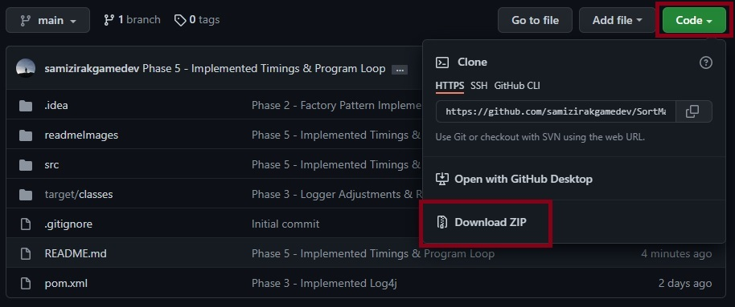
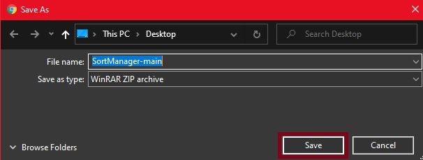
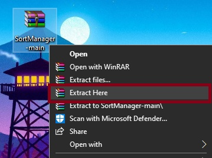
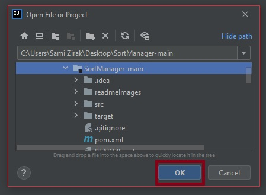
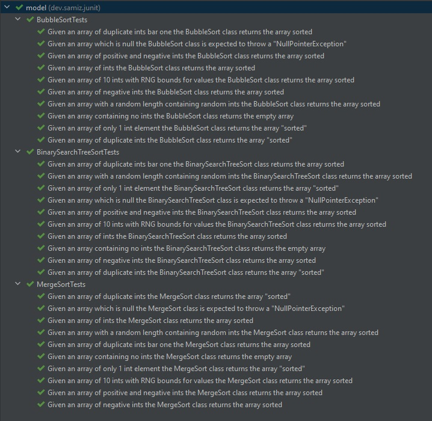
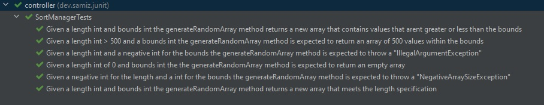

# Sort Manager Application (Java)
> By: Sami Zirak - Junior Java SDET Consultant | [Portfolio](https://samiz.dev/) | [GitHub](https://github.com/samizirakgamedev) | [LinkedIn](https://www.linkedin.com/in/sami-zirak-dezfouly/) | [Twitter](https://twitter.com/SamiZirakDev) |
> 
The Sort Manager program will be able to take in an array of **'ints'** and sort it using different sort algorithms. 
This project is being created as part of my ongoing training as a Junior Java SDET @ [Sparta Global](https://www.spartaglobal.com/).
### Table Of Contents ###
+ [Software & Dependencies](#software-&-dependencies)
+ [How To Use](#how-to-use)
+ [Planned Project Phases](#planned-project-phases)
  - [Phase 1](#phase-1)
  - [Phase 2](#phase-2)
  - [Phase 3](#phase-3)
  - [Phase 4](#phase-4)
  - [Phase 5](#phase-5)
+ [JUnit Testing](#junit-testing)
### Software & Dependencies ###
* **IntelliJ Community Edition** [Version 2021.3.2](https://www.jetbrains.com/idea/download/#section=windows)
* **JDK** [Version 17.0.2](https://jdk.java.net/17/)
* **Apache Maven**
  * _**Note:** This dependency can be imported using IntelliJ._
  * _Go to **"File" > "New Project"** and then selecting **"Maven"** as the project structure._
* **JUnit Jupiter API** [Version 5.8.2](https://mvnrepository.com/artifact/org.junit.jupiter/junit-jupiter-api/5.8.2)
  * _**Note:** This dependency can be imported within Intellij using Apache Maven and IntelliJ's built-in dependency generator._
  * Alternatively you can open the Maven **"pom.xml"** file and paste in the following code within the **"dependencies"** section of the file:
```xml
    <dependency>
        <groupId>org.junit.jupiter</groupId>
        <artifactId>junit-jupiter</artifactId>
        <version>5.8.2</version>
    </dependency>
```
* **Log4J Core** [Version 2.17.1](https://mvnrepository.com/artifact/org.apache.logging.log4j/log4j-core/2.17.1)
  * _**Note:** This dependency can be imported within Intellij using Apache Maven and IntelliJ's built-in dependency generator._
  * Alternatively you can open the Maven **"pom.xml"** file and paste in the following code within the **"dependencies"** section of the file:
```xml
    <dependency>
        <groupId>org.apache.logging.log4j</groupId>
        <artifactId>log4j-core</artifactId>
        <version>2.17.1</version>
    </dependency> 
```
<br/>
<div align="right">
    <b><a href="#sort-manager-application-java">↥ back to top</a></b>
</div>
<br/>

### How To Use ###
1. Navigate to the top of this GitHub repo and click the green **"Code"** button. This will open a menu where you will want to click **"Download Zip"**.

2. Having clicked "Download ZIP" a "Save As" dialogue box will open. Choose where you want to store the compressed Sort Manager program and then click the **"Save"** button.

3. Using Windows Explorer navigate to the location you saved the compressed Sort Manager program in. Right-click on the program and select **"Extract Here"**.

4. Open IntelliJ Community Edition and click **"File"** and then **"Open"**. Navigate to the extracted Sort Manager project folder and select it. Then click **"Ok"**.

5. Once the project has opened and all dependencies have been downloaded look to the top right-hand corner of IntelliJ and ensure that the class that has been set to run is **"SortManagerMain"**. You can now run the program by clicking the green play button.

<br/>
<div align="right">
    <b><a href="#sort-manager-application-java">↥ back to top</a></b>
</div>
<br/>

### Planned Project Phases ###
#### Phase 1 ####
I will be implementing the basic functionality for a program which will take an array of ints and sort that array firstly using a bubble sort algorithm and then a merge sort algorithm.
#### Phase 2 ####
I will be updating the project so that it implements design patterns like the [MVC](https://en.wikipedia.org/wiki/Model%E2%80%93view%E2%80%93controller) and [Factory](https://en.wikipedia.org/wiki/Factory_method_pattern) design pattern
as well as other principles of [OOP](https://en.wikipedia.org/wiki/Object-oriented_programming) like [SOLID](https://en.wikipedia.org/wiki/SOLID). I will be implementing tests to ensure the program's controller functions correctly.
#### Phase 3 ####
I will be updating the project to include logging code using Log4j. This will require me to implement a properties file that Log4j can read. I will be creating logs at different levels and fully testing the resulting output through having the output going to a log file created in the project's "**resources**" directory.
#### Phase 4 ####
I will be updating the project by implementing a binary search tree approach for sorting. The BST will be able to be called in the same way as the merge and bubble sort algorithms, this means like the merge and sort algorithms it will accept an array of ints and return an array of ints. I will also implement a nested class to represent a node in the tree. The BST algorithm will be subject to the same tests as the merge and bubble sort algorithms. It will be expected to pass them all.
#### Phase 5 ####
I will be adding timing information to the project and allow the user to select multiple algorithms to compare their performance.
<br/>
<div align="right">
    <b><a href="#sort-manager-application-java">↥ back to top</a></b>
</div>
<br/>

### JUnit Testing ###
Using JUnit I implemented tests for all 3 sort algorithms that were implemented within the Sort Manager. These test were:
1. Given an array of ints the sort algorithm returns the array sorted.
2. Given an array of only 1 int element the sort algorithm returns the array "sorted".
3. Given an array of duplicate ints the sort algorithm returns the array "sorted".
4. Given an array of duplicate ints bar one the sort algorithm returns the array sorted.
5. Given an array of negative ints the sort algorithm returns the array sorted.
6. Given an array of positive and negative ints the sort algorithm returns the array sorted.
7. Given an array containing no ints the sort algorithm returns the empty array.
8. Given an array which is null the sort algorithm is expected to throw a "NullPointerException".
9. Given an array of 10 ints with RNG bounds for values the sort algorithm returns the array sorted.
10. Given an array with a random length containing random ints the sort algorithm returns the array sorted.

Every sort algorithm had to pass the same tests. As you can see all 3 algorithms passed their respective 10 tests.


I also implemented some separate tests for the **generateRandomArray** method in the **SortManager** class. As you can see the method passed all its respective tests too:



<br/>
<div align="right">
    <b><a href="#sort-manager-application-java">↥ back to top</a></b>
</div>
<br/>